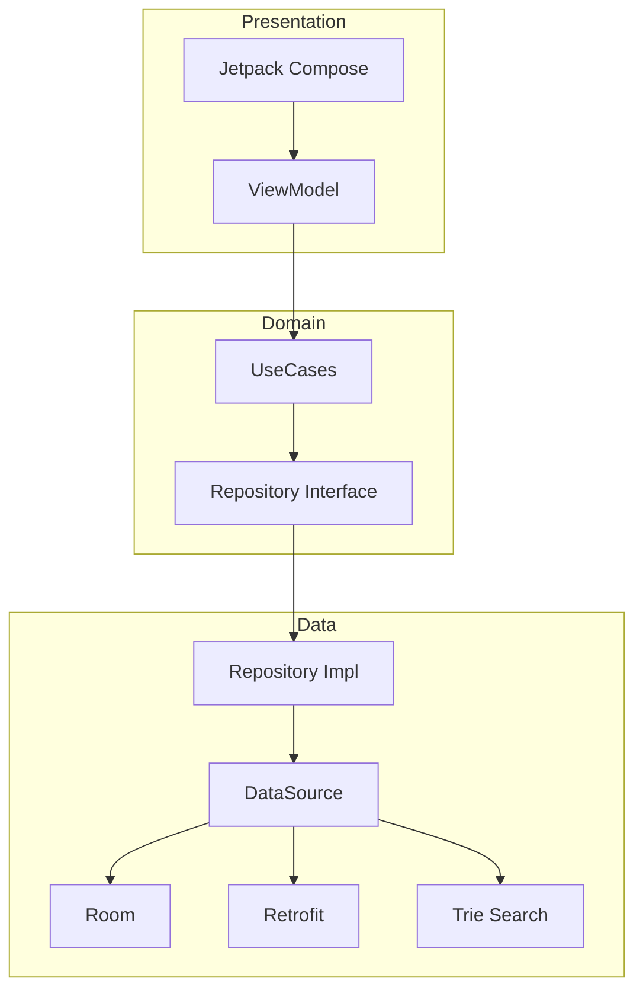

# CitySeeker by Boa Apps

With this app you will be able to search among more than 200 cities in the world, locate them on a
map and choose your favorites. It is about Android App Technical Testing with Kotlin, Compose,
Retrofit and Hilt.

## Documentation

Detailed documentation is available in the [`docs/`](docs/) folder:

| Document                                        | Description                                             |
|-------------------------------------------------|---------------------------------------------------------|
| [ARCHITECTURE.md](docs/ARCHITECTURE.md)         | Clean Architecture overview with Mermaid diagrams       |
| [TECH_DECISIONS.md](docs/TECH_DECISIONS.md)     | 5 ADRs documenting key technical decisions              |
| [CODE_STYLE.md](docs/CODE_STYLE.md)             | Code conventions and patterns extracted from codebase   |
| [TESTING_STRATEGY.md](docs/TESTING_STRATEGY.md) | Testing approach, MockK/Turbine templates, gap analysis |
| [PERFORMANCE.md](docs/PERFORMANCE.md)           | Bottlenecks identified and optimization recommendations |
| [LINT_CONFIG.md](docs/LINT_CONFIG.md)           | Detekt/ktlint configuration and custom rules            |
| [MONITORING.md](docs/MONITORING.md)             | Sentry/Crashlytics setup and observability              |
| [SECURITY.md](docs/SECURITY.md)                 | Security audit checklist and ProGuard rules             |
| [DEPLOYMENT.md](docs/DEPLOYMENT.md)             | Build variants, versioning, and release process         |
| [CI_CD.md](docs/CI_CD.md)                       | GitHub Actions, Bitrise, and CircleCI configurations    |

## Initial configuration

- Make a Mapbox account in https://account.mapbox.com/auth/signup/
- Go to Mapbox console and copy your new public token.
- In your `local.properties` file create add a line with this text: `mapboxToken={yourToken}`.
- In that line replace the string `{yourToken}` with your Mapbox public token.
- Use the latest stable version of Android Studio and download Android SDKs from API level 31
  onwards.
- (Optional) Add `SENTRY_DSN` to `local.properties` for crash reporting.

## Features

- Make a GET request to gist.githubusercontent.com to get test data.
- Parse the JSON response and map it to Kotlin objects.
- Create a UI with Jetpack Compose that displays the data in a list.
- Implement MVVM architecture to structure the code appropriately.
- Manage UI states (loading, success, error) efficiently.
- Use of Kotlin coroutines and reactive programming principles.
- Proper handling of states and errors in the UI.
- Following clean architecture and best practices in Android.
- Searching and filtering places using a text input (Trie-based prefix search).
- Filter cities by the cities marked as favorites.
- Favorite city functionality with datastore persistence.
- Optimized Room implementation to persist downloaded data.
- Optimized Retrofit implementation for fast and compressed connection and download.
- Auto-adjust layout to switch between light and dark theme.
- Using animations.
- Mapbox implementation to locate the selected city.
- Auto-adjust layout for screen rotation.
- Offline-first (after download json). In any case, a local copy of the file is available for the
  first upload in case there is no response from the API.
- Sentry integration for crash reporting and performance monitoring.
- LeakCanary for memory leak detection (debug builds).

### Using gist.githubusercontent.com API RESTful

#### Specifically the route GET all cities

```cURL
curl --location --globoff 'https://gist.githubusercontent.com/hernan-uala/dce8843a8edbe0b0018b32e137bc2b3a/raw/0996accf70cb0ca0e16f9a99e0ee185fafca7af1/cities.json'
```

#### Usage/Examples

```json
[
    {
        "country": "AR",
        "name": "Provincia de Mendoza",
        "_id": 3844419,
        "coord": {
            "lon": -68.5,
            "lat": -34.5
        }
    }
]
```

## Build & Run

```bash
# Debug build
./gradlew assembleDebug

# Release build (requires signing config)
./gradlew assembleRelease

# Run all tests
./gradlew test

# Lint check
./gradlew detekt ktlintCheck

# Auto-fix lint issues
./gradlew ktlintFormat
```

## CI/CD

The project includes CI/CD configurations for:

- **GitHub Actions** (primary) - `.github/workflows/ci.yml`
- **Bitrise** - See `docs/CI_CD.md` for configuration
- **CircleCI** - See `docs/CI_CD.md` for configuration

### Required Secrets

| Secret              | Description                     |
|---------------------|---------------------------------|
| `MAPBOX_TOKEN`      | Mapbox public token             |
| `SENTRY_DSN`        | Sentry DSN (optional)           |
| `KEYSTORE_BASE64`   | Base64 encoded release keystore |
| `KEYSTORE_PASSWORD` | Keystore password               |
| `KEY_ALIAS`         | Key alias                       |
| `KEY_PASSWORD`      | Key password                    |

## Architecture



See [ARCHITECTURE.md](docs/ARCHITECTURE.md) for full details.

## Next Steps

- [x] Analytics & Monitoring (Sentry + Crashlytics)
- [ ] Benchmarking (Macrobenchmark)
- [ ] Accessibility audit
- [x] Security audit (ProGuard + Network Security)
- [x] Performance audit (documented in PERFORMANCE.md)
- [ ] Add multi-language support
- [x] Improve code coverage with tests (templates in TESTING_STRATEGY.md)
- [ ] Publish to Play Store

## Considerations

- Initially, Ktor was attempted to be used with Realm, but better performance was achieved by
  replacing both with Room and Retrofit with compression and streaming.
- Decoupling of compose screens is prioritized over pagination.
- Pagination was postponed as it required unifying viewModels and/or modifying clean implementation
  to use cacheIn.

## License

This project is for technical assessment purposes.
