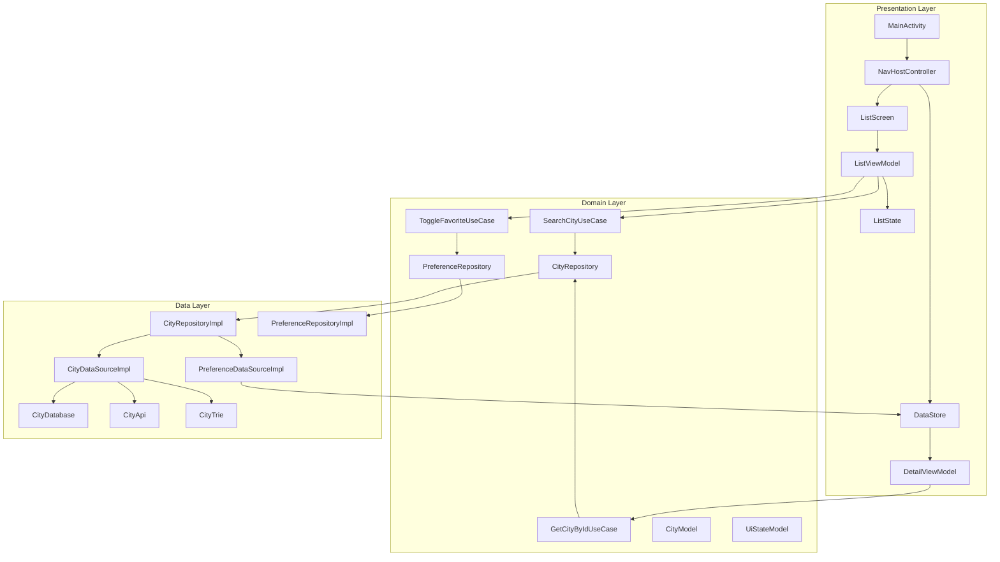
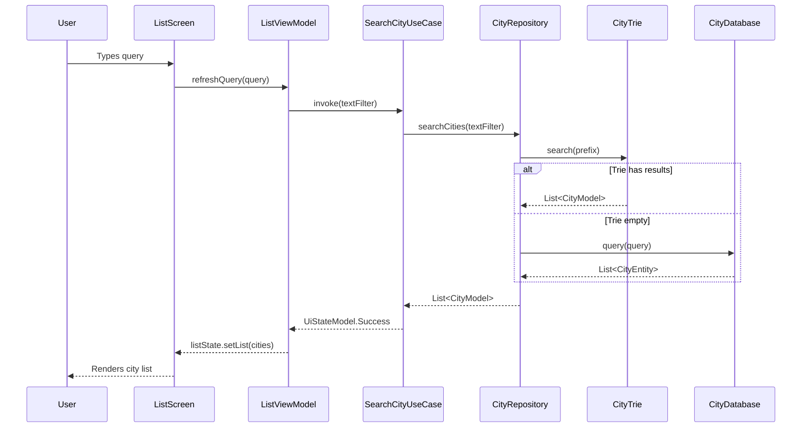
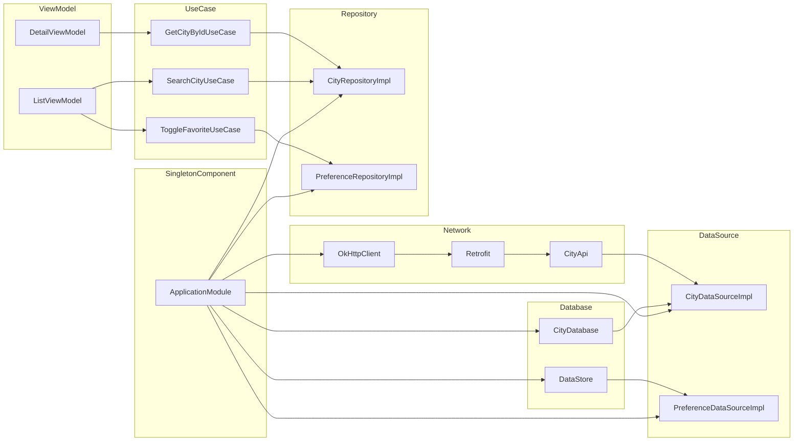
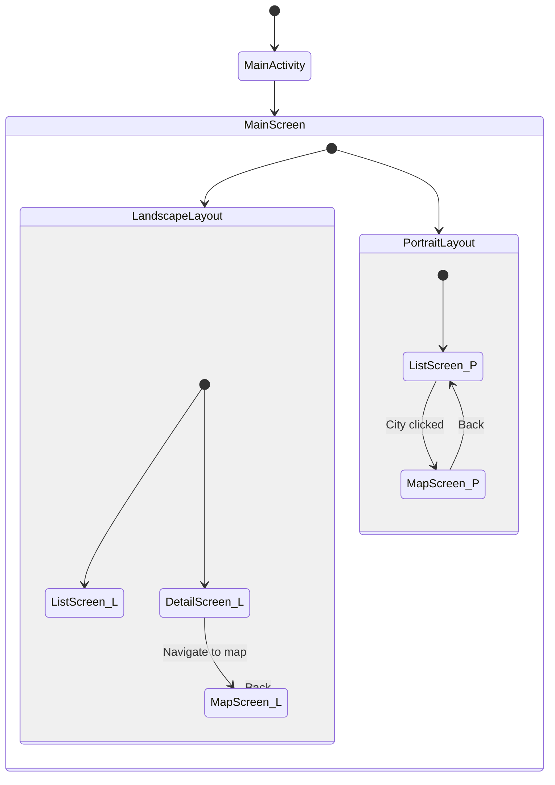
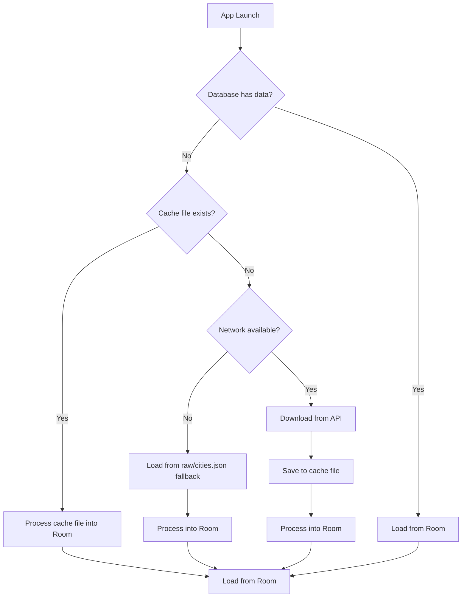

# Architecture Overview

CitySeeker follows **Clean Architecture** with a **single-module** structure (`:app`), using *
*MVVM + MVI** pattern with Jetpack Compose for UI.

## High-Level Architecture



## Layer Responsibilities

| Layer            | Responsibility                                       | Key Classes                                                                                                   |
|------------------|------------------------------------------------------|---------------------------------------------------------------------------------------------------------------|
| **Presentation** | UI rendering, user interaction, navigation           | `ListScreen`, `DetailScreen`, `MainScreen`, `ListViewModel`, `DetailViewModel`                                |
| **Domain**       | Business logic, use cases, repository interfaces     | `SearchCityUseCase`, `ToggleFavoriteUseCase`, `GetCityByIdUseCase`, `CityRepository`, `PreferenceRepository`  |
| **Data**         | Data sources, API calls, local storage, data mapping | `CityDataSourceImpl`, `PreferenceDataSourceImpl`, `CityRepositoryImpl`, `CityTrie`, `CityDatabase`, `CityApi` |

## Data Flow: City Search



## Dependency Injection Graph (Hilt)



## Navigation Flow



## Module Structure (Single Module)

```
app/
├── common/
│   └── Constants.kt
├── di/
│   └── ApplicationModule.kt
├── data/
│   ├── local/
│   │   ├── CityDatabase.kt
│   │   ├── dao/
│   │   │   └── CityDao.kt
│   │   └── entity/
│   │       └── CityEntity.kt
│   ├── mapper/
│   │   └── CityMapper.kt
│   ├── network/
│   │   └── CityApi.kt
│   ├── repository/
│   │   ├── CityRepositoryImpl.kt
│   │   └── PreferenceRepositoryImpl.kt
│   └── source/
│       ├── CityDataSource.kt
│       ├── CityDataSourceImpl.kt
│       ├── CityPagingSource.kt
│       ├── CityTrie.kt
│       ├── PreferenceDataSource.kt
│       └── PreferenceDataSourceImpl.kt
├── domain/
│   ├── base/
│   │   └── BaseMapper.kt
│   ├── model/
│   │   ├── CityModel.kt
│   │   └── UiStateModel.kt
│   ├── repository/
│   │   ├── CityRepository.kt
│   │   └── PreferenceRepository.kt
│   ├── usecase/
│   │   ├── GetCityByIdUseCase.kt
│   │   ├── SearchCityUseCase.kt
│   │   └── ToggleFavoriteUseCase.kt
│   └── util/
│       └── Extensions.kt
├── presentation/
│   ├── CitySeekerApp.kt
│   ├── MainActivity.kt
│   ├── component/
│   │   ├── ConnectivityStatus.kt
│   │   ├── FilterSwitch.kt
│   │   ├── LoadingIndicator.kt
│   │   ├── OfflineIndicator.kt
│   │   ├── SearchBar.kt
│   │   └── Utils.kt
│   ├── feature/
│   │   ├── city/
│   │   │   ├── CityItem.kt
│   │   │   ├── detail/
│   │   │   │   ├── DetailContract.kt
│   │   │   │   ├── DetailScreen.kt
│   │   │   │   └── DetailViewModel.kt
│   │   │   └── list/
│   │   │       ├── ListContract.kt
│   │   │       ├── ListScreen.kt
│   │   │       └── ListViewModel.kt
│   │   └── main/
│   │       └── MainScreen.kt
│   ├── navigation/
│   │   ├── NavigationGraph.kt
│   │   └── Screen.kt
│   ├── sensor/
│   │   └── ConnectivityReceiver.kt
│   └── ui/
│       ├── PreviewUtils.kt
│       └── theme/
│           ├── Color.kt
│           ├── Theme.kt
│           └── Type.kt
```

## Technology Stack

| Layer       | Technology                   | Version                    |
|-------------|------------------------------|----------------------------|
| Language    | Kotlin                       | 2.2.0                      |
| UI          | Jetpack Compose + Material 3 | 2025.07.00 (BOM)           |
| DI          | Hilt                         | 2.57                       |
| Database    | Room                         | 2.7.2                      |
| Network     | Retrofit + Gson + OkHttp     | 3.0.0 / 2.13.1 / 5.1.0     |
| Async       | Kotlin Coroutines + Flow     | 1.10.2                     |
| Navigation  | Jetpack Navigation Compose   | 2.9.3                      |
| Persistence | DataStore                    | 1.1.7                      |
| Maps        | Mapbox                       | 11.11.0                    |
| Animation   | Lottie                       | 6.6.7                      |
| Paging      | AndroidX Paging              | 3.3.6                      |
| Logging     | Timber                       | 5.0.1                      |
| Lint        | Detekt + ktlint              | 1.23.8 / 13.0.0            |
| Build       | Gradle + KSP                 | 8.12.0 (AGP) / 2.2.0-2.0.2 |

## Key Design Patterns

| Pattern                | Implementation                              | Location                                       |
|------------------------|---------------------------------------------|------------------------------------------------|
| **Clean Architecture** | Domain/Data/Presentation separation         | `app/src/main/java/com/boa/test/city/seeker/`  |
| **MVVM + MVI**         | ViewModel + StateFlow + sealed class states | `ListViewModel` + `ListState` + `UiStateModel` |
| **Repository**         | Abstraction over data sources               | `CityRepository` → `CityRepositoryImpl`        |
| **Use Case**           | Single responsibility business logic        | `SearchCityUseCase`, `ToggleFavoriteUseCase`   |
| **Trie**               | Efficient prefix search                     | `CityTrie.kt`                                  |
| **Observer**           | Reactive UI updates via StateFlow           | `ListState` with `MutableStateFlow`            |
| **DI**                 | Dependency injection via Hilt               | `ApplicationModule.kt`                         |
| **Adapter/Converter**  | Data mapping between layers                 | `CityMapper.kt`                                |

## Offline Strategy


